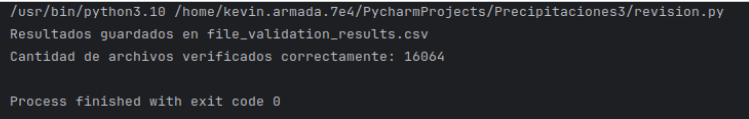
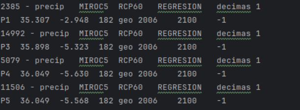
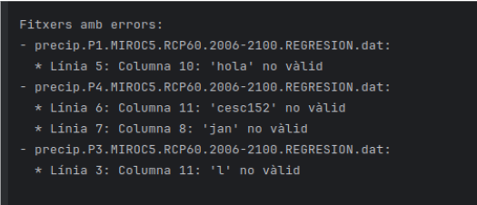
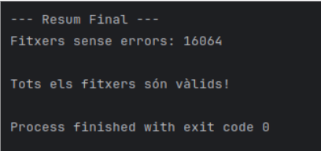
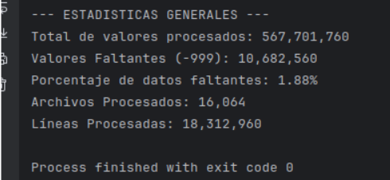

# Precipitaciones3
# 2  Organitzar i processar les dades
Para organizar y procesar los datos, lo que hemos hecho en el codigo, primero tiene que leer si todos los archivos tienen el mismo formato en este caso .dat, y si todos tienen el mismo formato por terminal saldria "Cantidad de archivos con el mismo formato .dat (cantidad de archivos)

---------------------------------------------------------------------------------------
Y tambien como se muestra en la imagen los resultados se han guardado en un archivo csv llamado "file_validation_results"

Este seria un ejemplo de cada archivo que guarda las 2 primeras lineas en el csv

---------------------------------------------------------------------------------------
# Limpiar Datos

Tenemos que verificar que los .dat no tengan ningun tipo de letra ya que solo los valores son numeros
Ejemploo de archivo .dat con errores

Archivo .dat sin errores

---------------------------------------------------------------------------------------

# Calcular datos

Ahora tenemos que procesar todos los .dat para sacar los siguientes valores: Valores procesados, Valores (-999), Porcentaje de datos faltantes, Archivos procesados y Lineas procesadas

Despues de calcular todos los datos tenemos que calcular precipitacion total y media por año, variacion anual de las precipitaciones, los años mas lluviosos y mas secos

